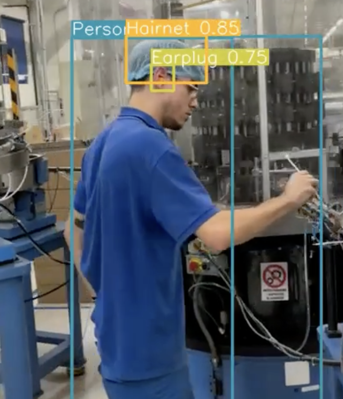
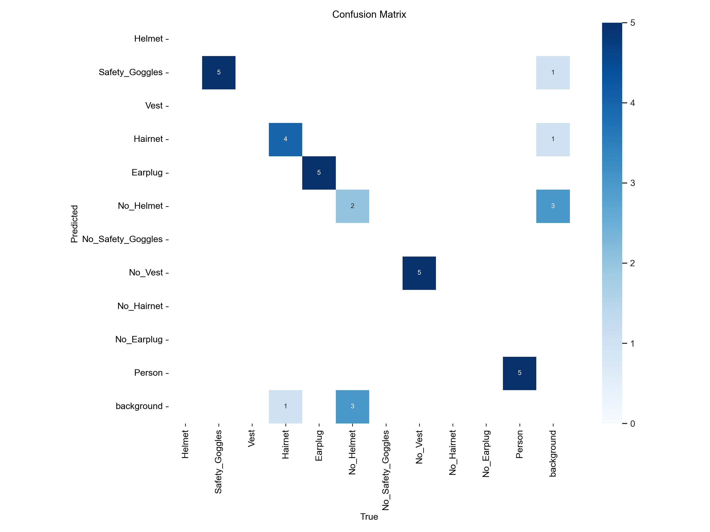
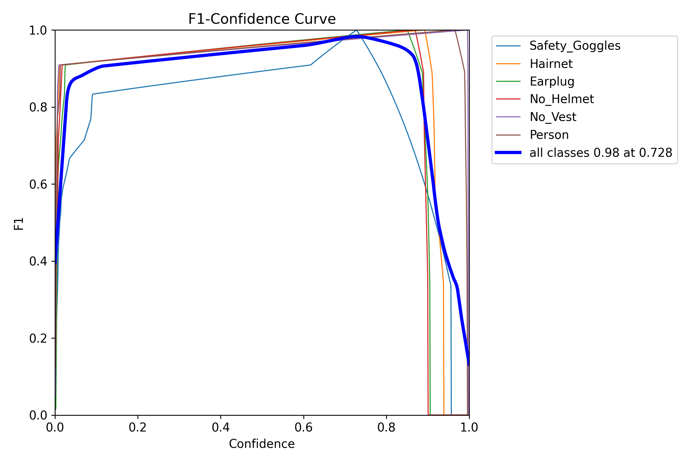
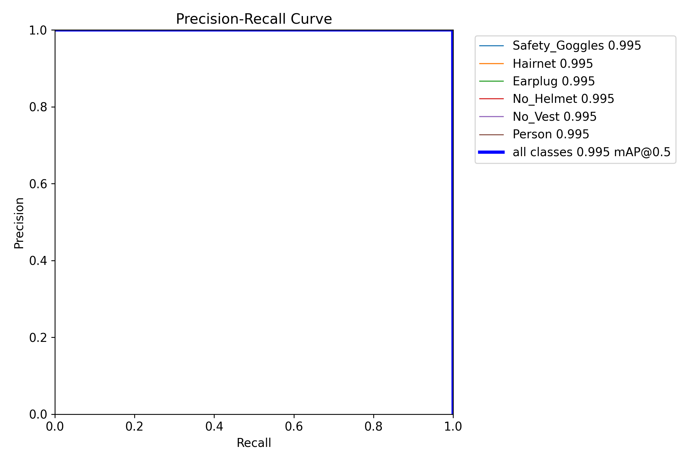
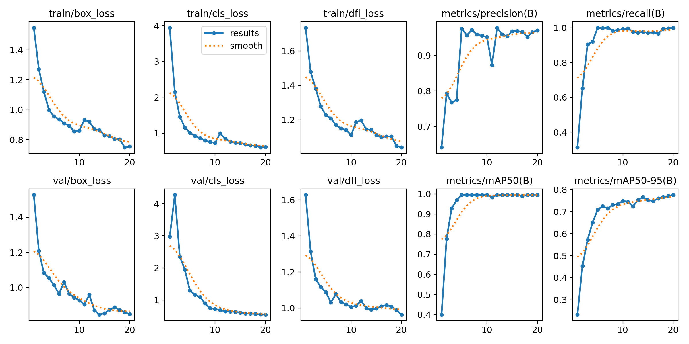

# PPE-Detection-YOLO

## Personal Protective Equipment Detection Using YOLOv8

This project implements the YOLOv8 model (provided by Ultralytics) for detecting Personal Protective Equipment (PPE) in industrial settings. [Demo Video](runs/detect/predict2/IMG_4504.mp4)



## Usage and Installation

To set up the project, follow these steps:

1. **Clone the Repository**:
    ```bash
    git clone https://github.com/akbaig/PPE-Detection-YOLO.git
    cd PPE-Detection-YOLO
    ```

2. **Install Requirements**:
    ```bash
    pip install -r requirements.txt
    ```

3. **Run Inference**:
    Open the `yolo_inference.ipynb` notebook and follow the instructions to perform inference.

4. **Fine-tune the Model**:
    Open the `yolo_finetuning.ipynb` notebook to fine-tune the model with your own dataset.

## Project Structure

```plaintext
PPE-Detection-YOLO/
├── annotated_dataset/
│   ├── train/
│   ├── valid/
│   └── test/
├── unannotated_dataset/
├── notebooks/
│   ├── yolo_inference.ipynb
│   └── yolo_finetuning.ipynb
├── results/
│   ├── confusion_matrix.png
│   ├── F1_curve.png
│   ├── PR_curve.png
│   └── results.png
├── test_videos/
├── requirements.txt
└── README.md
```

## Dataset

Our dataset comprises a total of 500 images, meticulously curated to ensure robust training and evaluation:

- **Annotated Images**:
    - **Total**: 100 images
    - **Training Set**: 80 images
    - **Validation Set**: 10 images
    - **Testing Set**: 10 images

- **Unannotated Images**:
    - Approximately 400 additional images are available in a separate folder for further use.

Additionally, we provide test videos located in the `test_videos` directory to facilitate comprehensive model evaluation.

*Dataset provided by [APTAR](https://aptar.com/) for hackathon purposes*

## Results

The results of our model's performance are stored in the `results` folder. Below is a detailed explanation of the common metrics:

### Confusion Matrix


### F1 Score Curve


### Precision-Recall Curve


### Summary of Key Performance Metrics


## Future Work

This implementation serves as a foundation for a comprehensive workplace safety monitoring system that can:

- **Detect Key Elements**:
    - 👥 People (with unique tracking IDs)
    - 🦺 PPE items (helmets, vests, gloves, boots)
    - ⚠️ Hazardous areas (danger zones, restricted areas)

- **Track Individuals**:
    - 🔄 Maintain consistent IDs across video frames
    - 📊 Monitor movement patterns through scenes

- **Associate PPE with Personnel**:
    - 🔍 Map detected PPE to specific individuals
    - 📏 Utilize IoU (Intersection over Union) calculations for accurate assignments

- **Enforce Compliance**:
    - ⚠️ Generate warnings when individuals enter non-PPE zones
    - 🚫 Identify missing required safety equipment

- **Monitor Compliance Over Time**:
    - 👀 Track PPE status changes throughout surveillance footage
    - ⏱️ Record duration of non-compliance events

- **Alert System**:
    - 🚨 Trigger notifications when violations exceed time thresholds
    - ☁️ Send compliance data to cloud systems for reporting

## Credits

This project was made possible thanks to the contributions and support from the following individuals and organizations:

- **APTAR**: For providing the dataset used in this project.
- **Ahmad Kamal Baig**
- **Abhinandan Roul**
- **Tirthendu Chakravorty**
- **Alaina Faisal**
- **Harry Hamjaya**
- **Masa Cirkovic**